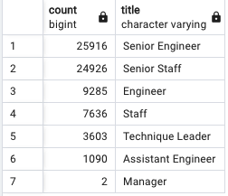

# pewlett-hackard-analysis

## Overview of Analysis
A large company is expecting a large wave of retirements as baby boomers reach retirement age. A SQL employee database is being built in order look ahead and get prepared for this retirement wave. The database will be queried to identify retirement package eligibility, mentorship program prospects, and positions that will need to be filled. 
### Purpose
The purpose of this analysis is to determine the number of employees retiring by title and to identify employees who are eligible for a mentorship program.

## Results
- The company currently has over 300,000 employees, of these employees 72,458 are expected to be retiring. 
- The largest group of retiring employees are Senior Engineers with 25,916 senior engineers preparing for retirement.
- The smallest retiring group are managers, as only 2 managers are expected to retire soon. 
- There is a total of 1,549 eligible mentors.

**Number of Retiring Employees by Title**

## Summary
This wave of retirement also known as the "silver tsunami" will lead to 72,458 positions of 7 different titles needing to be filled. The most in demand title that will need to be filled is senior engineer followed by senior staff. Of all the retirement ready employees, there are only 1,549 that are qualified for the mentorship program. This means that there are not enough mentors for the next generation of employees.

### Additional Queries
An additional table providing mentorship eligibility counts by title would make it easier to determine where mentors are most needed. Another table I would recommend is total employee count by title. This table will give a fuller picture of the distribution of employees. When compared to the retiring titles table, we can see the proportion of current to retiring employees.
